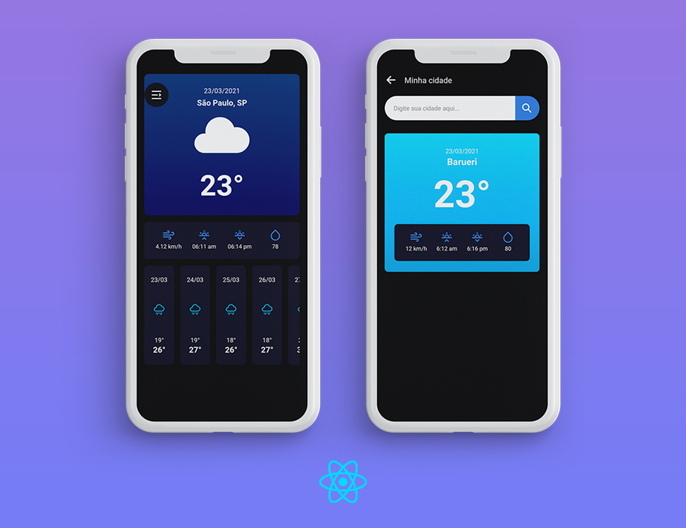

<h2>📃 Sobre o aplicação:</h2>
Aplicação mobile desenvolvida utilizando os conceitos e ferramentas do React Native que consome os dados da API <strong>"HG BRASIL - <a href="https://hgbrasil.com">hgbrasil.com</a>"</strong>. API responsável por fornecer dados em tempo real sobre a previsão do tempo/clima/temperatura das cidades do brasil
  

  
<h2>⚙️ Features:</h2>
<ul>
<li>Mostrar dados reais do clima/temperatura através da localização do dispositivo.</li>
<li>Pesquisa qualquer cidade do Brasil pelo seu nome.</li>
<li>Visualizar dados reais da previsão do tempo de cada cidade à partir do endereço de IP do usuário.</li>
</ul>
 
<h2>⚙️ Tecnologias e Ferramentas:</h2>
<ul>
<li><strong>React Native:</strong> É uma biblioteca JavaScript criado para construir interfaces de usuário para aplicativos móveis.</li>
<li><strong>Expo:</strong> É uma ferramenta utilizada no desenvolvimento mobile com React Native que permite o fácil acesso às API's nativas do dispositivo sem precisar instalar qualquer dependência ou alterar código nativo.</li>
<li><strong>API HG Weather:</strong> API de Previsão do Tempo para implementar em aplicações web/mobile.</li>
<li><strong>Axios:</strong> É um cliente HTTP baseado em Promises para interceptar requisições e respostas (request & response).</li>
  
<h2>🚀 Baixando aplicação:</h2>
<pre># Clone o projeto a partir do meu repositório:
$ git clone ... 
# Entre no diretório via prompt de comando:
$ cd react_native_weather
# Para abrir o projeto no VS CODE, use o comando:
$ code .
 
<pre>
<h2>🚀 Iniciando aplicação:</h2># Instale todas as dependências do projeto com o seguinte comando via terminal:
$ yarn 
# Inicie a aplicação com o Expo:
$ Usando via prompt de comando: expo start $ Usando yarn: yarn expo start $ Usando npm: npm expo start 
# O Expo vai abrir automáticamente no seu navegador. Agora é a hora de baixar o aplicativo "Expo Go" para escanear o QR CODE e acessar a aplicação mobile direto pelo seu próprio celular.
# Pronto, agora é só testar! 
<strong>Observações da API:</strong> Nesta aplicação, uso o plano gratuito da API "HG BRASIL" e neste caso ela limita na quatidade de 10 requisições feitas por dia em cada chave de acesso. Em outras palavras, você pode buscar até 10 cidades por dia na tela de "Minha cidade".</pre>